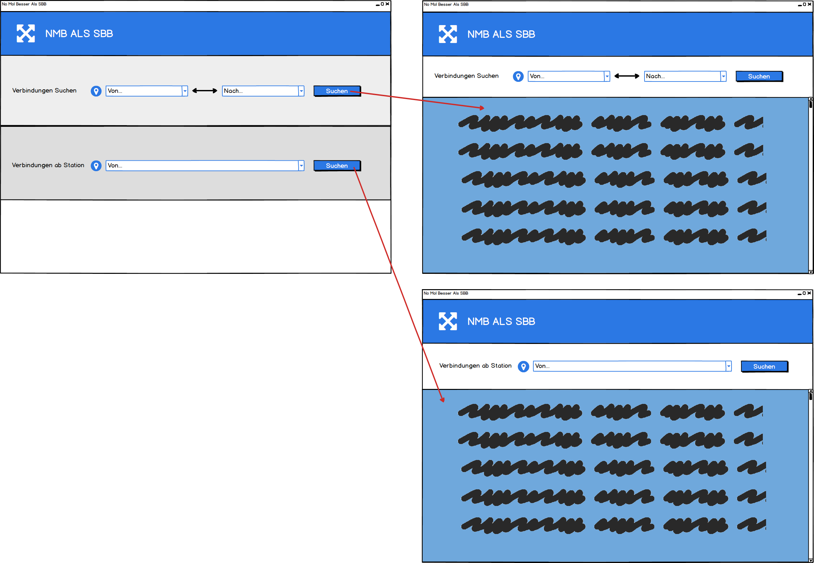
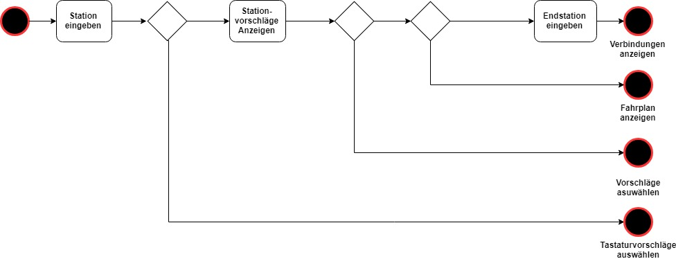
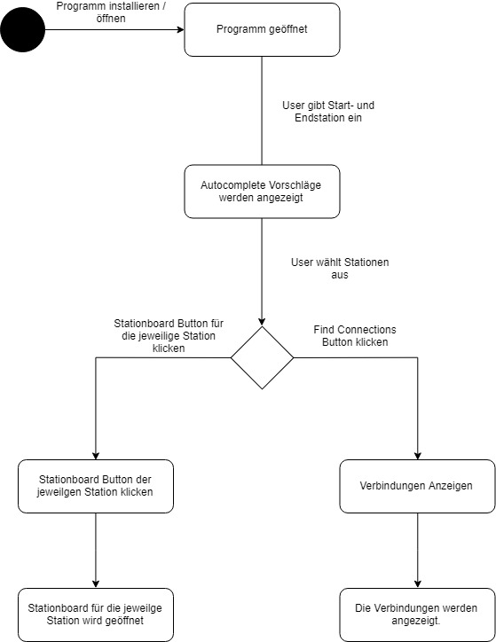

# Management Summary

Im ÜK 318 behandeln wir das Thema Objektorientiertes Programmieren. 
Wir haben ein paar Test-Übungen programmiert, die uns dabei später fürs Projekt helfen sollen. 
Zusätzlich wurde noch Stoff repetiert, den wir schon in der Berufsschule gelernt hatten.
Unser Projekt ist es eine Applikation zu entwickeln, die anhand von öffentlichen Fahrplandaten Verbindungen raussucht und diese Auch korrekt anzeigt. 
Zusätzlich noch Features, wie die Fahrpläne von Stationen auslesen etc. (ähnlich wie die SBB App).

# Zweck des Dokuments

Dieses Dokument dient zur Projektarbeit. Es sind verschiedene Punkte beschrieben, 
wie z.B. Funktionen des Programms, Use Cases, Testfälle, Installationsanleitung usw.

# Welche Funktionen wurden umgesetzt

1.	A001: Als ÖV-User möchte ich Start- und Endstation mittels Textsuche suchen können.
2. 	A002: Als ÖV-User möchte ich die aktuellen, d.h. mindestens die nächsten vier bis fünf Verbindungen 
    (Connections) zwischen den beiden gefundenen und Ausgewählten Stationen sehen, damit ich weiss wann ich zur Station muss. 
    Um den für mich idealen Anschluss zu erwischen.
3.  A003: Als ÖV-User möchte ich sehen welche Verbindungen ab einer bestimmten Station vorhanden sind, 
    damit ich bei mir zuhause eine Art Abfahrtstafel (Stationboard) haben kann.
4.  A004: Als ÖV-Benutzer möchte ich, dass schon während meiner Eingabe erst Such-Resultate erscheinen, 
    damit ich effizienter nach Stationen suchen kann.
5.  A005: Als ÖV-User möchte ich nicht nur aktuelle Verbindungen suchen können, 
    sondern auch solche zu einem beliebigen anderen Zeitpunkt, damit ich zukünftige Reisen planen kann.

# Mockup

Einfaches Mockup für die Applikation:



# Use Cases / AKtivitätsdiagramm

Die Usecases für mein Programm:



Das Aktivitätsdiagramm:



# Programmierrichtlinien

Was ist der Zweck von gemeinsamen Programmierrichtlinien:
**Wartbarkeit, Lesbarkeit, Ästhetik**

Bei der Erstellung von Software sollten immer folgende Faktoren in Erinnerung gerufen werden:

* Kann ich diesen Source-Code auch in einem Jahr noch verstehen?
* Ist meine Software ordentlich strukturiert/modularisiert oder gibt's haufenweise dubiose
  Querverbindungen zwischen den Modulen?
* Was passiert, wenn jemand anderer meinen Code betrachtet ("Code–Review") oder Änderungen vornehmen muss – wird er sich zurechtfinden?
* Erscheint meine Software aus "einem Guss" (konsequentes Anwenden von Kommentierungen, Einrückungen, Variablennamen...)?

**Sprache**
Grundsätzlich orientieren sich viele Variablennamen an der englischen Sprache und die Kommentare sind in Deutsch verfasst, 
sofern nicht Kundenanforderungen dies verhindern. Wie in der Programmierung üblich, ergibt sich oft ein Mix aus deutsch/englisch, 
was aber im Rahmen der natürlichen Empfindung zulässig ist. Es gelten allgemein die Regeln der neuen deutschen Rechtschreibung.

**Dokumentation**
Lästig, aber notwendig: Inbetriebnahme Anleitungen, Beschreibung von Funktionsbibilotheken, Bedienungsanleitungen, 
Berechnungs-Dokumentationen (Übersetzungsverhältnisse...) usw. Verweise auf diese Dokumente finden sich im jeweiligen Info-File.

#### Programmierrichlinien:

**Verwendung der geschweiften Klammern**

Die Zeichen { und } stehen immer als einzige Zeichen in einer Zeile. Zugehörige Klammern paare stehen in derselben Spalte.


**Gut:**		
```if(nX > 0)
{
    for(int i = 0; i< 10 i++)
    {
         adValue[int]++;
         adValueY[i]--;
    }
}
```

**Schlecht:**

```if(nX > 0) {
    for(int i = 0; i< 10 i++) {
         adValue[int]++;
         adValueY[i]--; }
}
```

**Notationen:**

**Pascal:** Der erste Buchstabe jeweils gross. **z.B.** ```MyIdentifier```
**Camel:** Am Anfgang klein, danach jeweil der erst Buchstabe gross. **z.B.** ```myIdentifier```

Je nach Bezeichenrtyp (Methode, Konstante, Vaiable...) werden unterschiedliche Notationen angewendet.

|	Bezeichner	|   Notation	|
|---	|---	|
|   Klasse	|   Pascal	| 
|	Methode	|	Pascal	|
|   Variablen	|   Camel	| 
|   Property	|   Pascal	|
|	Interface	|	Pascal mit Präfix I	|

**Kommentare:**

Kommentare und Kommentarzeichen dienen der Verständlichkeit und Strukturierung von Code. KOmmentare sind insbesondere dort anzuwenden,
wo eine spezielle Vorgangsweise dokumentiert werden soll. Sinnlose Kommentierung wie
```nTestVar++ // Testvariable inkrementieren```  
sind zu vermeiden, da sich diese Anweisung selbst schon ausreichen beschreibt.

# Systemtests
**Test 01 - Stationsuche**
User möchte mittels Textfeld Start- und Endstation suchen.

|   Schirtt	|   Aktivität	|   Erwartetes Resultat	|
|---	|---	|---	|
|   1	|   Abfahrtsort Gersag Bahnhof in Textfeld eingeben	|   Gersag Bahnhof wird mittels Autocomplete erkannt und eingegeben.	|
|   2	|   Endstation Luzern Bahnhof in Textfeld eingeben	|   Luzern Bahnhof wird mittel Autocomplete erkannt und eingegeben.	|

**Test 02 - Aktuelle Verbindungen Suchen**

User möchte die aktuellen Verbindungen zwischen Start- und Endstation finden.

|   Schirtt	|   Aktivität	|   Erwartetes Resultat	|
|---	|---	|---	|
|   1	|   Abfahrtsort Luzern Bahnhof in Textfeld eingeben	|   Luzern Bahnhof wird mittels Autocomplete erkannt und eingegeben.	|
|   2	|   Endsation Bahnhof Süd in Textfeld eingeben	|   Bahnhof Süd wird mittel Autocomplete erkannt und eingegeben.	|
|	3	|	Find Connections Button klicken	|	Es werden 4-5 Verbindungen angezeigt zwischen Gersag Bhf und Luzern Bhf.	|

**Test 03 - Verbindung nach bestimmter Zeit suchen**

User möchte die Verbindungen zwischen Start- und Endstation einer bestimmten Zeit finden.

|   Schirtt	|   Aktivität	|   Erwartetes Resultat	|
|---	|---	|---	|
|   1	|   Abfahrtsort Emmenbrücke Bahnhof in Textfeld eingeben	|   Emmenbrücke Bahnhof wird mittels Autocomplete erkannt und eingegeben.	|
|   2	|   Enstation Luzern Bahnhof in Textfeld eingeben	|   Luzern Bahnhof wird mittel Autocomplete erkannt und eingegeben.	|
|	3	|	Abfahrtszeit eingeben	|	Abfahrtszeit wurde im Datum Feld eingegeben.	|
|	4	|	Find Connections Button klicken	|	Es werden 4-5 Verbindungen angezeigt zwischen Gersag Bhf und Luzern Bhf.	|

**Test 04 - Stationen anhand Ort suchen**

User möchte Anhand vom Ort alle verfügbaren Stationen finden.

|   Schirtt	|   Aktivität	|   Erwartetes Resultat	|
|---	|---	|---	|
|   1	|  Ortsnamen (Emmenbrücke) eingeben	|  Es werden alle Bahnhöfe in der nähe von Emmenrbücke angezeigt.	|

# Installationsanleitung

